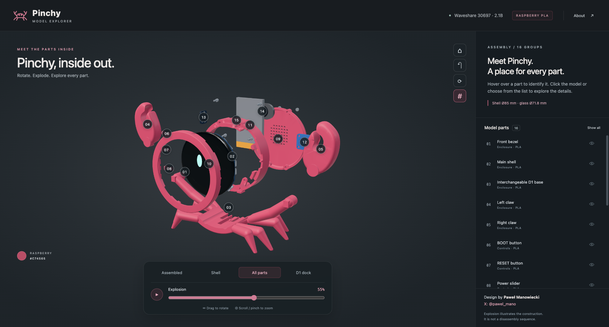

# Pinchy

**TODO — Firmware:** No firmware source code or flashable binaries are included in this repository. Firmware development and publication are deferred. See [TODO](TODO.md).

**A raspberry desktop companion by Paweł Manowiecki · [X: @pawel_mano](https://x.com/pawel_mano)**

[Polski](README_PL.md) · [Live 3D explorer](https://pablo-mano.github.io/Pinchy/) · [Print files](printing/README.md) · [BOM](electronics/BOM.md) · [Wiring](electronics/WIRING.md) · [Assembly](docs/ASSEMBLY.md) · [Films](videos/README.md)

“**Hey Pinchy!**” — a small crab-shaped companion built around the **Waveshare ESP32-S3-Touch-LCD-2.1B, SKU 30697**. The current enclosure has a shaped screen seat, side controls, four M2 board mounts, a removable rear cover and an interchangeable D1 slide-and-click base. Complete leg pairs leave room for USB cables.

**Release status: mechanical prototype and audio fit/wiring study.** This repository includes printable parts and build documentation. Final audio/battery holders, electrical validation and functional voice-assistant firmware are still unfinished. The films are demonstrations on sample data. Start with [what can be built today](docs/BUILD_STATUS.md).

## Start here

1. Read the [BOM](electronics/BOM.md) and confirm the board variant — **30697 / 2.1B**, nominal Ø71.8 mm glass.
2. Print the screen-fit and D1 coupons using the [prepared Bambu P2S projects](printing/README.md).
3. Follow the [assembly guide](docs/ASSEMBLY.md) and validate mechanical fits.
4. Study the [connection diagram and cable plan](electronics/WIRING.md) before bench-testing the optional audio components.
5. Review the [firmware status](docs/FIRMWARE.md) and [remaining milestones](docs/BUILD_STATUS.md) before expecting working voice or online integrations.

## Print and edit

Target: **Bambu Lab P2S · 0.4 mm nozzle · Generic PLA · Textured PEI · 100% scale**. Raspberry reference color: `#C74565`.

| Download | Contents |
|---|---|
| [Plate 01](printing/plates/01_B_Proba_i_przyciski_P2S_PLA.3mf) | Screen-fit coupon, controls and spares |
| [Plate 02](printing/plates/02_B_Obudowa_P2S_PLA.3mf) | Front bezel, central shell and rear cover |
| [Plate 03](printing/plates/03_B_Nogi_i_szczypce_P2S_PLA.3mf) | D1 leg base and claws |
| [Plate 04](printing/plates/04_D1_Proba_mocowania_P2S_PLA.3mf) | D1 interface coupons — test before the full base |
| [STL parts](printing/stl/) | Individual print-oriented parts and coupons |
| [STEP parts](printing/step/) | Editable printed-part solids and [D1 receiver template](printing/step/D1_receiver_interface_TEMPLATE.step) |

All four plates total approximately **12 h 17 min / 148.36 g** in the saved slicer estimates. Print coupons first and allow material for retries. [Printing instructions](printing/README.md).

## Interactive exploded view

[Open/download the standalone HTML](site/index.html): rotation, zoom, 16 part groups with tooltips, an explosion slider, isolation controls and a D1 base view. It works offline and has no backend. The viewing mesh is simplified; use the STL/STEP/3MF files for printing.

**[Open the live interactive explorer →](https://pablo-mano.github.io/Pinchy/)**

The [GitHub Pages workflow](.github/workflows/pages.yml) publishes `site/` from `main`. [Deployment and update instructions](docs/PUBLISHING.md).

## Product films

Both editions include the “Hey Pinchy!” wake phrase, OpenAI TTS voices, the InPost/email/calendar/theater scenario, exploded assembly, D1 base and full orbit. **58⅔ seconds**, with cuts on the beat of **Jamie Bathgate — Status** and readable dialogue over a reduced music level.

| Language | Full HD | Smaller full-length file |
|---|---|---|
| English | [1080p](videos/Pinchy_EN_1080p.mp4) | [720p](videos/Pinchy_EN_720p.mp4) |
| Polski | [1080p](videos/Pinchy_PL_1080p.mp4) | [720p](videos/Pinchy_PL_720p.mp4) |

[Subtitles and media details](videos/README.md). The visible author credit is **Paweł Manowiecki · X: @pawel_mano** throughout.

## Build documentation

- [BOM with quantities and fit status](electronics/BOM.md) · [CSV](electronics/BOM.csv).
- [Wiring guide](electronics/WIRING.md) · [diagram SVG](electronics/01_connection_diagram.svg) · [diagram PNG](electronics/01_connection_diagram.png) · [netlist CSV](electronics/connections.csv).
- [Cable routing SVG](electronics/02_cable_routing_plan.svg) · [routing coordinates](electronics/cable_routes.json) · [3D cable study](electronics/Pinchy_cable_plan.glb).
- [Assembly guide and tools](docs/ASSEMBLY.md) · [D1 dimensions in Polish](docs/D1_INTERFACE_PL.md).
- [Firmware requirements](docs/FIRMWARE.md) · [build status and remaining work](docs/BUILD_STATUS.md).
- [Source credits and third-party notices](THIRD_PARTY_NOTICES.md).
- [Validation and its limits](docs/VALIDATION.md).
- [Delivery manifest](manifest.json): file sizes and SHA-256 hashes.

The package preserves the established mechanical part identifiers from revision B/D1 (previously C03B) for consistency between print and CAD files. The product name is **Pinchy**.
