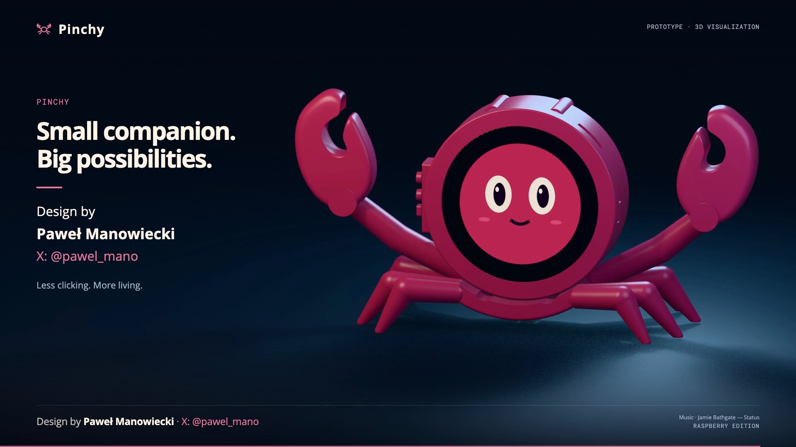

# Pinchy

**TODO — firmware:** W repozytorium nie ma kodu firmware ani plików do wgrania na urządzenie. Implementację i publikację firmware odkładamy na później. [Lista TODO](TODO.md).

**Projekt: Paweł Manowiecki · [X: @pawel_mano](https://x.com/pawel_mano)**

[English](README.md) · [Widok rozstrzelony online](https://pablo-mano.github.io/Pinchy/) · [Druk](printing/README_PL.md) · [BOM](electronics/BOM.md) · [Połączenia](electronics/WIRING_PL.md) · [Filmy](videos/README.md)

Malinowy towarzysz biurkowy w kształcie kraba, oparty na **Waveshare ESP32-S3-Touch-LCD-2.1B / SKU 30697**. Wywołanie w koncepcji produktu: **„Hey Pinchy!”**. Obudowa ma profilowane podparcie szkła, cztery mocowania M2, boczne przyciski, zdejmowaną pokrywę i wymienną podstawę D1. Pełne nogi zostawiają miejsce na USB między parami.

**To prototyp mechaniczny z przymiarką audio i planem okablowania.** Można wydrukować i przymierzyć obudowę. Docelowe uchwyty audio/baterii, pełna wiązka, pomiary elektryczne i działający firmware asystenta pozostają do wykonania. Rozmowa w filmach jest oznaczoną demonstracją. [Pełny stan projektu i kolejne kroki](docs/BUILD_STATUS.md).

## Co jest w repozytorium

- **[Fotograficzny diagram połączeń — interaktywny](https://pablo-mano.github.io/Pinchy/wiring/)** · [PNG](electronics/03_physical_connections.png) · [PDF A3](electronics/03_physical_connections.pdf) · [SVG](electronics/03_physical_connections.svg) · [źródła i założenia](electronics/physical_wiring/README.md). Wariant z baterią Akyga LP503759 1350 mAh i wzmacniaczem DFRobot DFR0954; połączenia wymagają testów na stole.

- **4 aktualne projekty 3MF** dla Bambu Lab P2S, dysza 0,4 mm, Generic PLA, skala 100%: [próbnik i przyciski](printing/plates/01_B_Proba_i_przyciski_P2S_PLA.3mf), [obudowa](printing/plates/02_B_Obudowa_P2S_PLA.3mf), [podstawa i szczypce](printing/plates/03_B_Nogi_i_szczypce_P2S_PLA.3mf), [próbnik D1](printing/plates/04_D1_Proba_mocowania_P2S_PLA.3mf).
- [STL](printing/stl/) i [STEP](printing/step/) części drukowanych, w tym szablon do własnych podstaw D1.
- [Samodzielna strona HTML](site/index.html) z obrotem modelu, rozstrzeleniem, opisami 16 grup i podglądem D1.
- Filmy **PL:** [1080p](videos/Pinchy_PL_1080p.mp4) / [720p](videos/Pinchy_PL_720p.mp4), **EN:** [1080p](videos/Pinchy_EN_1080p.mp4) / [720p](videos/Pinchy_EN_720p.mp4). Nowe wywołanie, głosy OpenAI TTS, muzyka „Status”, przejścia na beat i podpis autora.
- [BOM](electronics/BOM.md) i [CSV](electronics/BOM.csv), [diagram połączeń](electronics/01_connection_diagram.svg), [plan kabli](electronics/02_cable_routing_plan.svg), [netlista](electronics/connections.csv) i [instrukcja elektryczna](electronics/WIRING_PL.md).
- [Instrukcja montażu](docs/ASSEMBLY.md), [druk](printing/README_PL.md), [obsługa D1](docs/D1_INTERFACE_PL.md) oraz [wymagania przyszłego firmware](docs/FIRMWARE.md).

Najpierw wydrukuj próbnik D1 i próbnik szkła. Obudowa jest dla wersji **B / 30697, szkło nominalnie Ø71,8 mm**, nie dla płaskiej wersji 28169. Szacowany komplet czterech płyt to 12 h 17 min i 148,36 g PLA; dolicz zapas na próby.

## GitHub Pages

Repozytorium: **[pablo-mano/Pinchy](https://github.com/pablo-mano/Pinchy)**.

Strona: **[pablo-mano.github.io/Pinchy](https://pablo-mano.github.io/Pinchy/)**. Workflow publikuje `site/` po zmianie strony na gałęzi `main`. [Instrukcja aktualizacji](docs/PUBLISHING.md).

W katalogu nie ma kluczy API ani konfiguracji prywatnych kont. [Źródła i prawa do elementów zewnętrznych](THIRD_PARTY_NOTICES.md).
