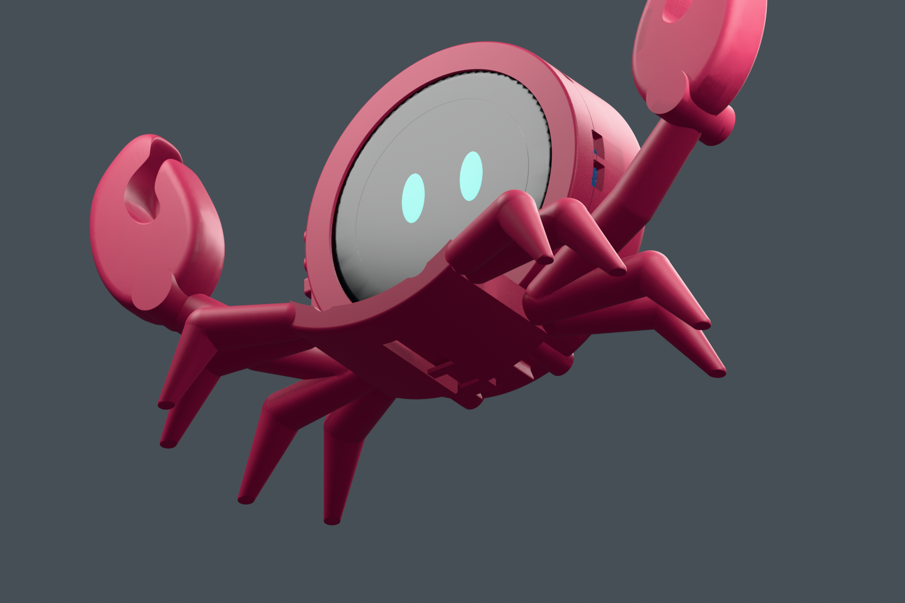

# Pinchy assembly guide

Read the [BOM](../electronics/BOM.md), [printing notes](../printing/README.md), [wiring plan](../electronics/WIRING.md) and [build status](BUILD_STATUS.md) first. These steps cover the mechanical prototype; the full voice assistant is not yet a completed kit.

## Tools and preparation

Use small screwdrivers matching your chosen fasteners, flush cutters, tweezers and support-removal tools. Electronics work additionally needs a fine-tip soldering iron, solder/flux, a multimeter and suitable insulation. A current-limited bench supply is useful during electrical bring-up.

Verify the board marking: **Waveshare 30697 / ESP32-S3-Touch-LCD-2.1B**. Keep the factory glass and PCB assembly intact. Print and test the screen coupon and both D1 interface coupons. Remove supports from control guides, rails and the space around the flexure before checking fits.

## Enclosure

1. Place the front bezel face-down on a soft surface. Fit the complete Waveshare module with compressible glass-edge support. Do not press bare glass rigidly against the printed lip. Nominal axial allowances are approximately 0.2 mm at the front and 0.4 mm at the rear, subject to padding compression and the actual unit.
2. Fit the BOOT cap, RESET cap and power slider in their guides. BOOT has one dot, RESET two; the slider has grooves. Confirm full travel and spring return.
3. Bring the central shell over the assembly. Its four supports align with the board's factory M2 mounting nuts.
4. From the open rear, fit **four M2 × 5 mm machine screws** with heads within Ø3.8 × 2 mm. Check actual usable thread depth; nominal engagement is 2.6 mm. Tighten evenly without bending the board or loading the glass.
5. Test the controls and touch surface before closing. The modeled audio insertion order is battery → amplifier → microphone → speaker, but final holders and wiring are not supplied. Do not leave loose conductive modules inside a powered enclosure.
6. Fit the rear service cover and secure the enclosure with **four Ø2.5 × 25 mm screws suitable for plastic**, heads up to Ø4.8 mm. These differ from the M2 board screws. Ordinary M2.5 machine screws are not automatic substitutes.

## Interchangeable D1 base

Keep the current shell and base together as a matched D1 pair. With cables disconnected, begin with the base about 20 mm forward of its seated position, on the display side. Slide it rearward along both rails until the rounded detent seats. The complete legs provide USB clearance between their pairs.

To remove the base, support the shell, press the rear release tab **down and away from the shell**, and slide the base forward toward the display. Do not pry on the claws or use the base to carry the complete device before validating retention.

The latch is a printed PLA flexure, not a separately purchased spring. Remove all supports, inspect for cracks/whitening and test repeated release on the coupons. Rail profile clearance is nominally 0.25 mm. Change the interface geometry rather than globally scaling the whole model if adjustment is necessary. [Detailed dimensions in Polish](D1_INTERFACE_PL.md).

## Before electrical integration

Check button return, glass support, screw clearance, cover engagement, USB plug approach and base release with the power off. Verify all J9/J1 conductors and supply conditions on the actual board. Resolve battery charging and the amplifier VCC tap before connecting them. The [wiring document](../electronics/WIRING.md) lists the unverified points explicitly.

Audio mounting, acoustic sealing, strain relief and full harness routing require another integration iteration. Once firmware exists, the release also needs a reproducible flashing guide, recovery method and measured acceptance tests.
