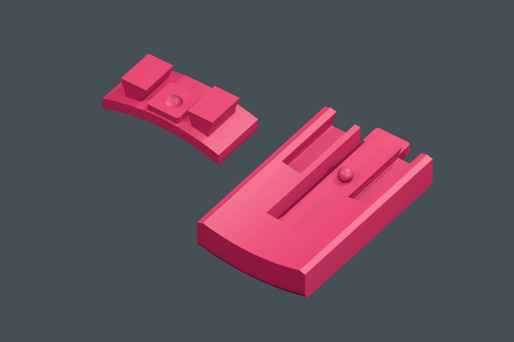

# Pinchy — wymienna podstawa D1

Dwie prowadnice typu jaskółczy ogon przenoszą obciążenie. Zaokrąglony garb na sprężystym języczku zatrzymuje podstawę w położeniu końcowym. Języczek jest częścią podstawy, bez osobnej sprężyny, zębatki i wkrętów. To prototyp do fizycznej próby w PLA.

*Wycinki rozłożone obok siebie, obie powierzchnie styku skierowane do góry. Lewy wycinek korpusu jest odwrócony względem położenia w krabie.*

## Zakładanie i wymiana

1. Chwyć pancerz, ustaw podstawę około 20 mm przed pozycją końcową, od strony ekranu. Otwarty tył rowków podstawy skieruj na szyny pod korpusem.
2. Przesuń podstawę ku tyłowi urządzenia do ogranicznika. Garb powinien schować się na języczku, a następnie wskoczyć w wgłębienie. Nie wymuszaj ruchu przy oporze.
3. Aby zdjąć podstawę, podeprzyj korpus i naciśnij wystającą tylną łopatkę od spodu **w dół, od pancerza**. Trzymając ją odchyloną, wysuń podstawę do przodu, w stronę ekranu. Szczypce mogą zostać na podstawie.

Podstawę wymienia się bez otwierania komory elektroniki. Przed zmianą odłącz zewnętrzne przewody i nie podnoś całego urządzenia za samą podstawę do czasu fizycznej próby utrzymania obciążenia.

## Próbnik do PLA

Najpierw otwórz [płytę 04](../printing/plates/04_D1_Proba_mocowania_P2S_PLA.3mf). Zawiera wycinek korpusu z obiema szynami i wycinek podstawy z kompletnym języczkiem. Około **48 min / 7,92 g PLA**, Bambu Lab P2S 0,4 mm, warstwa 0,16 mm. Osobne STL są w `stl/00_D1_*` i mają orientację do druku.

Usuń podpory z rowków, przestrzeni pod języczkiem i wokół ogranicznika. Sprawdź bez elektroniki: swobodne prowadzenie, lekki klik, brak samoczynnego wysuwania oraz łatwe zwolnienie języczkiem. Powtórz kilka razy, obejrzyj nasadę pod kątem pęknięć i zbielenia PLA. W razie ciasnego prowadzenia popraw parametr `CLEARANCE` w generatorze, nie skaluj całego STL. Siła kliku, nośność, trwałość i pełzanie PLA nie zostały zmierzone. Unikaj pozostawiania języczka stale odgiętego lub w nagrzanym samochodzie.

Po udanej próbie wydrukuj razem aktualny **02_crab_rear** i **03_crab_base**. Starszy korpus i starsza podstawa nie mają zgodnego interfejsu D1. Przód B, pokrywa B, szczypce i nakładki przycisków mogą zostać z poprzedniej wersji C03B.

## Interfejs dla kolejnych designów

[Szablon gniazda podstawy STEP](../printing/step/D1_receiver_interface_TEMPLATE.step) jest dokładnym wycinkiem gotowej podstawy z rowkami, sprężyną i ogranicznikiem. Nie obracaj go względem złożenia STEP. Zachowaj cały wycinek i dobuduj nową podstawę do jego zewnętrznych boków; nie wypełniaj rowków ani pustej przestrzeni wokół języczka. Sprawdź na pełnym złożeniu drogę wsuwania, dostęp do łopatki i USB. Szablon daje wspólne mocowanie, ale nie gwarantuje stabilności dowolnego nowego designu.

Układ współrzędnych CAD: X w prawo, Y do góry, Z ku tyłowi; środek ekranu X=Y=0. Podłoga gotowego kraba Y=−56 mm. Wszystkie poniższe wymiary są w mm, skala 1:1.

| Cecha | Wartość |
|---|---|
| Osie prowadnic X | −8 i +8; rozstaw 16 |
| Odcinek szyn korpusu Z | 13…22; długość 9 |
| Profil jednej szyny | szyjka 4, rozszerzenie 6 |
| Spód szyny Y | −45,6 |
| Luz profilu rowka | odsunięcie konturu o 0,25, nie powiększenie całego modelu |
| Początek rowków / przedni ogranicznik Z | 13 |
| Otwarty koniec rowków | ku dodatniemu Z, od tyłu podstawy |
| Języczek | grubość 1,2; wolna szerokość 6,4; długość do łopatki ok. 32 |
| Garb | kula R1,6; środek (0; −44,8; 20) |
| Gniazdo garbu | kula R2,2 o tym samym środku |
| Ogranicznik ugięcia przy garbie | nominalna droga 1,35 |
| Próba rozłączenia CAD | przybliżone odchylenie garbu ok. 1,05; wysuw 20 |

Dokładny kontur szyn i szablon są zapisane w STEP oraz `design/waveshare_crab_21b/dock.py`. Współrzędne są wspólne z całym krabem; STL próbników są obrócone i wyzerowane na stole drukarki.

## Weryfikacja

`dock_validation.json`: brak przenikania korpusu i podstawy w pozycji końcowej, zgodność próbników, zatrzymanie przesuwu na garbie i ograniczniku, utrzymanie poprzeczne przez prowadnice. Sprawdzono 41 położeń wysuwania co 0,5 mm, wraz ze szczypcami. Po odsunięciu języczka nie znaleziono kolizji z przodem, korpusem ani pokrywą.

Ugięcie zastąpiono obrotem geometrii swobodnej części języczka o 3°. To kontrola miejsca, **nie analiza naprężeń ani wyznaczenie siły zwolnienia**. Wydruk próbny jest potrzebny przed uznaniem tego połączenia za gotowe do regularnego użytkowania.
