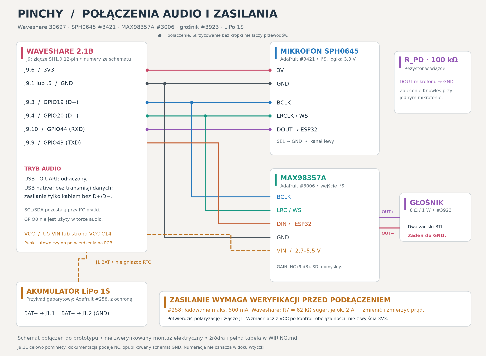
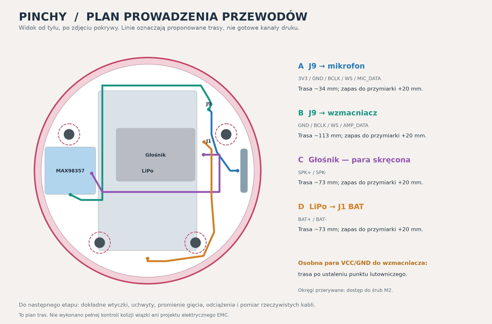

# Pinchy — proposed wiring and cable routing

**New photo diagram (1 October 2026):** [interactive view](https://pablo-mano.github.io/Pinchy/wiring/) · [PNG](03_physical_connections.png) · [PDF A3](03_physical_connections.pdf) · [SVG](03_physical_connections.svg) · [source and assumptions](physical_wiring/README.md). This variant uses the confirmed Akyga AKY0107 / LP503759 1350 mAh pack, the procurement-list DFRobot DFR0954 amplifier (not separately confirmed) and the Kamami 560816 speaker. Dashed power connections require verification. The earlier diagrams and battery-specific details below describe the Adafruit reference parts.

[Polski: pełna instrukcja](WIRING_PL.md) · [BOM](BOM.md) · [Netlist CSV](connections.csv)

This is a **bench-test proposal**, not an electrically validated assembly. The connector numbers below come from the published Waveshare schematic; the drawing is not a connector-face view. Establish pin 1 and continuity on the actual **30697 / 2.1B** board.

[Vector diagram](01_connection_diagram.svg) · [Routing SVG](02_cable_routing_plan.svg) · [3D routing study](Pinchy_cable_plan.glb) · [Route coordinates](cable_routes.json)

| From | To | Function / condition |
|---|---|---|
| J9.6 / 3V3 | SPH0645 3V | Microphone power |
| J9.1 or J9.5 / GND | Microphone GND and amplifier GND | Common ground; route amplifier return with its power lead |
| J9.3 / GPIO19 / D− | Microphone BCLK + amplifier BCLK | Shared bit clock; conflicts with native USB |
| J9.4 / GPIO20 / D+ | Microphone LRCLK + amplifier LRC | Shared word clock; conflicts with native USB |
| Microphone DOUT | J9.10 / GPIO44 / RXD | Audio input; board UART switching must be verified |
| J9.9 / GPIO43 / TXD | Amplifier DIN | Audio output; board UART switching must be verified |
| Microphone SEL | Microphone GND | Select left channel |
| Microphone DOUT | 100 kΩ resistor to GND | Pull-down for the single-microphone arrangement |
| Verified VCC net at U5 VIN or VCC side of C14 | MAX98357 VIN | Physical solder point and current capability not yet verified |
| MAX98357 OUT+ and OUT− | Speaker terminals | BTL output: **neither terminal goes to ground** |
| Protected LiPo BAT+ / BAT− | J1.1 BAT / J1.2 GND | Only after charge-current, connector and polarity verification |

J9.11 is deliberately unused: the documentation and an older schematic disagree about NC versus GND. J9 is SH1.0 12-pin; the main battery connector is separately described as MX1.25 2-pin. The RTC battery socket is not the device supply.

## USB, UART and I²S

GPIO19/20 are native USB data pins. GPIO43/44 share the UART path and hardware switching. In the proposed audio mode, USB TO UART must be disconnected and firmware must release these pins. Verify the multiplexer and continuity on the physical board before wiring the full harness.

A native-USB power-only connection must leave device-side D+ and D− **individually isolated, including from one another**. Generic charge-only cables/data blockers may short them. A programming data cable is not automatically suitable for audio-mode power. Stop audio and use a service configuration for programming.

Preliminary bench format: Philips I²S, 48 kHz, two 32-bit slots, BCLK 3.072 MHz. Confirm SPH0645 data alignment before processing audio. The microphone requires a BCLK/WS ratio of 64. No MCLK is needed. MAX98357 GAIN is left open for the module default; start at low volume, respect the speaker's 1 W rating and send the same speech to both slots.

## Power conditions still to resolve

The amplifier requires a verified supply within its module rating, with common ground, sufficient current and suitable decoupling. The proposed VCC tap is not a confirmed physical solder pad. Measure behavior on USB, battery and both power-switch positions; do not assume USB VBUS exists on battery or load the board's 3V3 rail with the amplifier without a power budget.

The Adafruit #258 reference pack permits at most **500 mA charging**. The published board schematic's ETA6098 and R7=82 kΩ suggest roughly **2 A**; this is a schematic inference, not a measurement of this board. Resolve and measure the charger setting before connecting that pack. No substitute resistor or second parallel charger is specified here. A battery's capacity or discharge-current rating does not establish its allowed charge current.

Match the actual main-battery connector and verify BAT+/GND by measurement. The Adafruit JST-PH lead is not automatically compatible with the Waveshare connector.

## Routing

- **A, microphone:** from J9 along the upper side to the microphone; keep away from speaker and amplifier power wiring.
- **B, amplifier data:** above the battery toward the amplifier. The narrow gap beside the battery is not assumed to fit an entire bundle.
- **C, speaker:** a short twisted OUT+/OUT− pair around the speaker edge, away from the microphone acoustic port.
- **D, battery:** along the side to J1, away from M2 heads and the cover seam, with strain relief.
- **Amplifier VCC/GND:** a separate pair; final route awaits the verified VCC connection point.

Nominal route centerlines are about 34 / 113 / 73 / 73 mm for A/B/C/D. These are not finished cut lengths. Begin with approximately 20 mm service allowance, then fit the actual connectors and bends. Signal-wire target is flexible 30 AWG with insulation up to Ø0.7 mm; power/speaker wire 26–28 AWG remains subject to current, voltage-drop and fit checks.

Final connectors, bend radii, microphone channel, audio holders, battery restraint, antenna clearance and the whole-harness collision check are unfinished. The four printed M2 supports secure the Waveshare board, not the extra audio modules.

## Source references

- [Waveshare documentation](https://docs.waveshare.com/ESP32-S3-Touch-LCD-2.1) and [published schematic](https://files.waveshare.com/wiki/ESP32-S3-Touch-LCD-2.1/ESP32-S3-Touch-LCD-2.1_schematic_diagram.pdf).
- [SPH0645 pinout](https://learn.adafruit.com/adafruit-i2s-mems-microphone-breakout/pinouts) and [Knowles datasheet](https://cdn-shop.adafruit.com/product-files/3421/i2S%20Datasheet.PDF).
- [MAX98357A pinout](https://learn.adafruit.com/adafruit-max98357-i2s-class-d-mono-amp/pinouts).
- [Adafruit battery #258](https://www.adafruit.com/product/258) and [ETA6098 datasheet](https://www.eta-semi.com/wp-content/uploads/2022/03/ETA6098_V1.1.pdf).
- [ESP32-S3 I²S](https://docs.espressif.com/projects/esp-idf/en/latest/esp32s3/api-reference/peripherals/i2s.html).

Electrical plan originally documented on 25 September 2026; this package changes its project name and links, not its validation status.
